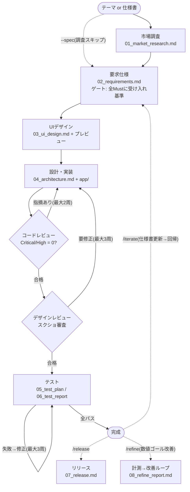

# ai_agent_skills_mcp_hooks_template

**市場調査 → POC試作 / 本番開発 → テスト → リリース** まで一気通貫で実行できる、AIアプリ開発基盤のAPMパッケージです。
`apm install` 一発で、Claude Code・GitHub Copilot など複数のAIコーディングエージェントに同じ開発環境を配備できます。

| 同梱物 | 内容 |
|---|---|
| skills 12個 | market-research / requirements / design / implement / test-app / pipeline / poc / promote / iterate / release / refine / user-test |
| agents 9体 | 市場アナリスト、要求エンジニア、UIデザイナー、アーキテクト、実装者、コードレビュアー、デザインレビュアー、テストエンジニア、AIユーザー(ペルソナ評価) |
| 品質基準 7本 | 調査 / 仕様 / デザイン(AIっぽさ排除)/ 実装 / テスト / SaaS(認証・決済)/ モバイル(PWA・ネイティブExpo) |
| hooks | セッション開始時に成果物一覧を自動通知(進捗把握・途中再開用) |
| MCP | Playwright(E2E・動作確認)+ Context7(最新ライブラリドキュメント) |

## 目次

1. [クイックスタート](#1-クイックスタート)
2. [使い方 — 5つの開発プロセス](#2-使い方--5つの開発プロセス)
3. [出力される成果物](#3-出力される成果物)
4. [Claude Code と GitHub Copilot の違いと使い分け](#4-claude-code-と-github-copilot-の違いと使い分け)
5. [トラブルシューティング / FAQ](#5-トラブルシューティング--faq)
6. [チーム運用ルール](#6-チーム運用ルール)
7. [リポジトリ構成](#7-リポジトリ構成)

---

## 1. クイックスタート

### 事前に必要なもの(全員共通)

| ツール | 用途 | 入手先 |
|---|---|---|
| Node.js LTS | MCPサーバーの起動・アプリの実装/テスト | https://nodejs.org |
| Python 3.10+ | APM CLIの動作要件 | https://www.python.org |
| APM CLI | このパッケージのインストール | https://github.com/danielmeppiel/apm |

### インストール手順(使うツールの列を上から実行するだけ)

ツールによる違いは **`--target` の値** と **Claude Codeだけ手順3がある** の2点だけです。開発プロジェクトのフォルダで実行してください。

| 手順 | GitHub Copilot (VS Code) | Claude Code |
|---|---|---|
| 1. パッケージ導入 | `apm install normozisan/ai_agent_skills_mcp_hooks_template --target copilot` | `apm install normozisan/ai_agent_skills_mcp_hooks_template --target claude` |
| 2. 規約ファイル生成 | `apm compile -t copilot` | `apm compile` |
| 3. 権限設定コピー | (不要) | `robocopy apm_modules\normozisan\ai_agent_skills_mcp_hooks_template\template . /E` |
| 4. 開始 | VS CodeでCopilotを開く | `claude` を起動 |

<details>
<summary>各手順が何をしているか(クリックで展開)</summary>

- **手順1**: skills・agents・hooks・MCPが各ツールの規定場所(Copilot: `.github/` 等 / Claude: `.claude/`)に自動配備されます。同時に `apm.yml` / `apm.lock.yaml` が生成されます
- **手順2**: 開発規約を規定ファイル(Copilot: `.github/copilot-instructions.md` / Claude: `AGENTS.md`)に生成します
- **手順3(Claude Codeのみ)**: `apm install` 時に `apm_modules/` へダウンロード済みのプロジェクト雛形をコピーします。目的はほぼ1つ、**権限の事前許可設定(`.claude/settings.json`)を置くこと**。これが無くても動きますが、npmやgitの実行ごとに許可確認が出て自動実行が止まりがちになります。一緒にコピーされる `docs/`・`app/` は出力先の説明用で、無くても自動生成されます。Mac/Linuxでは `cp -r apm_modules/normozisan/ai_agent_skills_mcp_hooks_template/template/. .`
- 新規の空フォルダでは `--target` 指定が必須です(既存プロジェクトでは自動検出されます)

</details>

つまずいたら → [5. トラブルシューティング](#5-トラブルシューティング--faq)

---

## 2. 使い方 — 5つの開発プロセス

チャットで `/` を打つとスキル一覧が出ます(Claude Code / VS Code Copilot 共通)。やりたいことに合わせて選んでください:

| # | やりたいこと | コマンド |
|---|---|---|
| 1 | テーマだけある → **Web調査つきでPOC試作** | `/poc <テーマ>` |
| 2 | 仕様書がある → **POC試作**(調査なし) | `/poc --spec 仕様書.md` |
| 3 | テーマだけある → **いきなり本番開発**(調査から) | `/pipeline <テーマ>` |
| 4 | 仕様書がある → **いきなり本番開発**(調査なし) | `/pipeline --spec 仕様書.md` |
| 5 | POCが検証できた → **本番品質に昇格** | `/promote` |

- **完成後**: 機能追加・修正は `/iterate <変更内容>`、公開準備は `/release`、数値目標の追い込みは `/refine <測定可能なゴール>`(例: `/refine Lighthouse Performance 90以上`)、**ユーザー目線の仕上げは `/user-test`**(市場調査のペルソナになりきったAIユーザーがPlaywrightで実操作→4軸20点で採点→不満上位2件を改善、を合格ライン(既定16/20、最大3ラウンド)まで自動反復)
- **完全自動**: `--auto` を付けると途中の質問なしで走ります(例: `/pipeline --auto <テーマ>`)
- **途中再開**: `/pipeline` は中断しても再実行すれば完了済みフェーズをスキップして続きから再開します

<details>
<summary>パイプライン全体図(状態遷移グラフ — クリックで展開)</summary>

決定的な骨格(フェーズと完了ゲート)の中でだけAIが知能を発揮するグラフ構造です。ゲートを通らない限り次へ進めず、差し戻しエッジには周回上限があります。



`/poc` はこのグラフの軽量短絡版(軽量調査→1ページ仕様→実装→スモーク確認)で、`/promote` で本流の要求仕様ノードに合流します。

</details>

### 品質はどう担保されるか(本番モード 3・4・5)

- 実装品質チェックリスト(セキュリティ・堅牢性・アクセシビリティ)準拠
- 独立したcode-reviewerによるレビュー(Critical/High指摘ゼロまで修正ループ)
- design-reviewerによる実画面スクリーンショット審査(デスクトップ+モバイル幅、「AIっぽい見た目」の排除)
- 境界値・異常系込みの自動テスト(Vitest + Playwright)

### 対応プラットフォーム

- **Web / Webアプリ / PWA**: 標準対応
- **スマホアプリ**: 要求仕様フェーズで自動判定。既定はPWA、ストア配布・プッシュ通知等がMust要件なら ネイティブ(Expo)に切り替わり、テスト(jest-expo + Maestro)・リリース(EAS Build → TestFlight / Play内部テスト)もネイティブ手順になります
- **SaaS(認証・決済・サーバーDB)**: 自動判定でSaaSガイドライン適用(認証を自作しない/カード情報に触れない/Supabase + Stripe既定/特商法表記等の法務要件)

<details>
<summary>上級Tips: /refine・/goal・/loop の使い分け(クリックで展開)</summary>

なお「AIユーザーが満足するまで評価→改善を回す」は、長い `/goal` 文を書かなくても **`/user-test` 一発**でできます(ループ・合格ライン・上限・記録すべて内蔵)。以下は数値ゴール系の使い分けです。

役割の違う3層で、組み合わせ可能です:

| コマンド | 提供元 | 役割 |
|---|---|---|
| `/refine <ゴール>` | このパッケージ | **改善の型**: 計測→仮説1つ→実装→再計測→採用/巻き戻し。1回の呼び出しでループが内部完結(到達 / 上限周回(既定5、`--max-loops N`)/ 2周連続改善なし、で自動停止)。テストや計測を弱めて達成に見せる行為は禁止。記録は `docs/08_refine_report.md` |
| `/goal <完了条件>` | Claude Code組み込み(v2.1.139+) | **終了の審判**: 検証可能な完了条件を張って自律実行し、独立チェッカーがターンごとに達成判定 |
| `/loop [間隔] <コマンド>` | Claude Code組み込み | **時間軸のリピーター**: 指定コマンドを間隔または自己ペースで繰り返す |

**基本は `/refine` 単体で足ります**(ループ内蔵):

```
/refine 本番ビルドのJSバンドル合計を200KB以下に
/refine トップ画面のLCPを1.5秒以内に --max-loops 10
```

**`/goal` と併用すると二重ループの入れ子**になります(外側が「終わり」を審判、内側が「進み方」を律する):

```
外側: /goal のチェッカー … ターンが終わるたび「条件を満たす証拠が出たか」を独立判定
  内側: /refine の型   … 計測 → 仮説1つ → 実装 → 再計測 → 採用 / 巻き戻し
```

ただし `/goal` からの `/refine` 自動採用は説明文マッチによる確率的な選択で保証ではありません。確実に型で回したいときは、**ゴール条件に refine の成果物を含める**のが有効です(`docs/08_refine_report.md` は `/refine` だけが作る成果物のため):

```
/goal docs/08_refine_report.md に Lighthouse Performance 90以上の到達が計測記録つきで書かれている
```

**`/loop` を重ねるのは時間軸の繰り返しが欲しいときだけ**:

```
/loop 30m /refine Lighthouse 90以上を維持。達成済みなら何もせず終了   ← 開発期間中の品質見張り番
/loop /iterate Should要件を優先度順に1つ実装。全部終わったら停止      ← 夜間のバックログ消化
```

注意: `/refine` を `/loop` で単純に囲むのは無意味です(「2周改善なし」の停止は頭打ちの判断。粘らせたいなら `--max-loops` を上げる)。`/loop` を無人で回すときは「〜したら停止」という終了条件をプロンプトに必ず書いてください。

</details>

---

## 3. 出力される成果物

本番開発では、一般的な開発文書に相当するドキュメントが `docs/` に自動生成されます。フェーズ間の受け渡しはすべてこのファイル群で行われ、要件ID・テストケースIDが相互参照されます。

| 一般的な呼び名 | ファイル |
|---|---|
| 市場調査報告書 | `docs/01_market_research.md` |
| 要求仕様書 / 要件定義書 | `docs/02_requirements.md` |
| 画面設計書 / デザイン仕様書 | `docs/03_ui_design.md` + `docs/design_preview.html`(ブラウザで見られるモック) |
| 基本設計書〜詳細設計書 | `docs/04_architecture.md` |
| テスト計画書 / テスト仕様書 | `docs/05_test_plan.md` |
| テスト結果報告書 | `docs/06_test_report.md` |
| リリースノート | `docs/07_release.md`(`/release` 実行時) |
| 改善ループ記録 | `docs/08_refine_report.md`(`/refine` 実行時。計測値の推移・採用/巻き戻しの記録) |
| AIユーザー評価レポート | `docs/09_user_eval.md`(`/user-test` 実行時。採点推移・改善記録。※実ユーザーの代用ではなく「見せる前の粗取り」) |

アプリ本体は `app/` に出力されます。POC(プロセス1・2)では軽量版(`docs/poc/` にPOC仕様1ページ+POCレポート)のみ生成されます。

---

## 4. Claude Code と GitHub Copilot の違いと使い分け

**結論: どちらでも使えますが、`/pipeline` の5フェーズ完全自動はClaude Code、Copilotはフェーズを1つずつ回す運転が現実的です。**(2026年7月時点)

| | Claude Code | GitHub Copilot |
|---|---|---|
| スラッシュコマンド起動 | ○ | ○(VS Codeチャットで `/` から選択、自動マッチも有効) |
| `/pipeline` 一発の5フェーズ完全自動 | **○** | ×(メインのAIが1人で順にこなす形になる) |
| 並列エージェントの起動主体 | エージェント自身が判断して8体に委譲 | ユーザーが `/fleet`(Copilot CLI)で明示的に起動 |
| 独立レビュアーによる検証ループ | ○(実装者と別コンテキストのレビュアー) | 限定的 |

### Copilotでの推奨の使い方

フェーズを1つずつ実行します。フェーズ間の受け渡しは `docs/` のファイルで行う設計のため、**1つずつでも品質・成果物はClaude Codeと同一**です:

```
/market-research <テーマ> → /requirements → /design → /implement → /test-app
```

並列にしたい箇所(調査のファンアウト等)は Copilot CLI の `/fleet` を手動で組み合わせられます。その際、`/fleet` にはファイルロックが無いため**同じファイルを複数エージェントに書かせない**こと(出力先を分けて、統合はスキルに任せる)。

### 途中でツールを乗り換えられる

成果物がファイルベースなので「調査・仕様はCopilot → 実装以降はClaude Codeで `/implement` から」という運用も成立します。再開ロジックがdocs/を見て完了フェーズをスキップするため、どちらから再開しても噛み合います。

### なぜ完全自動はClaude Code推奨なのか

品質の核である「実装 → 独立したコンテキストを持つレビュアーの審査 → 修正ループ」と「スキルからスキルを呼ぶオーケストレーション」がClaude Codeのサブエージェント機構に乗っているためです。この領域は機能追加が速いので、導入時に各ツールで一度試走することを推奨します。

---

## 5. トラブルシューティング / FAQ

**Q. `Filename too long` エラーが出る(Windows)**
`git config --global core.longpaths true` を実行してから再試行してください。深い階層のフォルダで発生します。

**Q. MCPサーバーの登録が進まない / 失敗する**
Node.js がインストールされているか確認してください(MCPは npx 経由で起動)。MCP登録に失敗しても skills/agents/hooks は配備済みです。Claude Code なら `template/.mcp.json` をプロジェクト直下にコピーすれば MCP を利用できます。

**Q. Claude Code で権限確認が頻発する**
クイックスタート手順3(`template/` のコピー)を実行したか確認してください。`.claude/settings.json` が権限を事前許可します。

**Q. `template/` フォルダには何が入っているの?**

| ファイル | 用途 |
|---|---|
| `.claude/settings.json` | 権限設定(npm/git等の事前許可、`.env` 読み取り拒否)+ SessionStartフック |
| `.mcp.json` | MCP設定(APMのMCP登録が失敗した場合のフォールバック) |
| `CLAUDE.md` | パイプライン規約(クローン利用時用。APM利用時は `AGENTS.md` で代替) |
| `docs/` `app/` | 成果物・アプリの出力先(無くても自動生成) |
| `.gitignore` | node_modules 等の除外設定 |

**Q. APMを使わずに導入できる?**
できます(Claude Code のみ)。リポジトリをクローンし、`.apm/skills` → `.claude/skills`、`.apm/agents` → `.claude/agents` にコピーして、`template/` の中身をプロジェクト直下に置いてください。

---

## 6. チーム運用ルール

- **このリポジトリがマスター**です。改良はクローンして編集 → push(またはPR)
- 各メンバーはプロジェクトで `apm update && apm compile` を実行すると最新版に追従できます
- プロジェクト側の `apm.yml` / `apm.lock.yaml` はコミットしてください。2人目以降は引数なしの `apm install` だけで同一環境を再現できます
- コストの温度感: **捨てる実験はスキルを使わず直接指示でOK、人に見せるPOCは `/poc`、作り続けるものは `/pipeline`**。本番パイプラインはサブエージェントを多数動かすためトークン消費が相応にあります

---

## 7. リポジトリ構成

```
├── apm.yml                  ← APMマニフェスト(MCP依存: playwright, context7)
├── .apm/
│   ├── skills/              ← 12 skills(品質基準7本・成果物テンプレート同梱)
│   ├── agents/              ← 9 agents(*.agent.md)
│   ├── instructions/        ← パイプライン規約(AGENTS.md / copilot-instructions に展開)
│   └── hooks/               ← SessionStartフック(進捗自動通知)
└── template/                ← プロジェクト雛形(Claude Code利用時に手動コピー)
```
